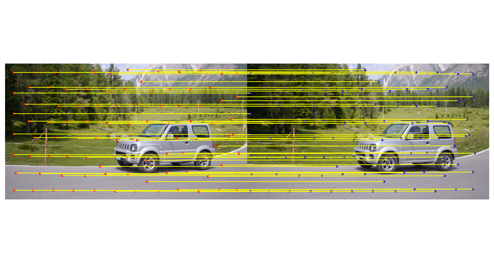

# MAST-SAM 
Try to solve the multiview Inconsistency Problem

## Stage I (Utilize the Pretrain Model Well)
- We track the points correspondance using mast3R, 


- We segment the image using SAM


## State II (Modify The Pretrain Model's output)
- Convert output masks as output mask points


- Trance the mask points to next picture 


## Stage III 
- Image Association is changed from first image to the rest of image, to last image to current image n to n+1
- Newly added area updating. Once the camera is start moving, there will be newly added part of image will be introduced. To solce that, we add an update module
- Union find mask overlapping merging: some time generateing mask can overlap with each other, current algorithm use union-find searching algorithm to accelerate
- cuml K-means clustering, for k means clustering
- Filtering stratgy to avoid noise solution


## Current Problem and updating
- Do not always trace the first image, some time need to update SAM segmentation, and some time, need to update the reference picture


- After changing to n to n+1, we always have reasonable image tracing


- Frequncy of updating sometimes lead to a collapse of SAM model, SAM sometime generate noise ultimatly leads to collapse
To be specific, the following images has a yellow bad prompt points connect car and road together will utimatly lead to collapse


The way to solve this problem is to introduce fitering stratgy that filter out small un connective points to major result, and increase the update length


## Running Example
```
OPENBLAS_NUM_THREADS=4 python SAM_automask_butian.py --image_dir /home/xiongbutian/workspace/davis2017-evaluation/DAVIS/JPEGImages/480p/bear/ --debuggin
```

## Argument
- sam_version: The same version, usually vit h 
- sam_checkpoint: sam_vit_h_4b8939.pth
- mast3r_checkpoint: the place where we keep mast3R
- image_dir: the image directories holding all images like a video sequence
- debugging: if debugging save many images
- output_dir: output images in output_dir 
