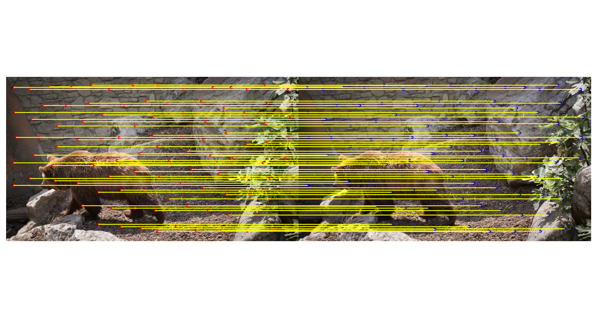

# MAST-SAM 
Try to solve the multiview Inconsistency Problem

## Stage I (Utilize the Pretrain Model Well)
- We track the points correspondance using mast3R, 


- We segment the image using SAM


## State II (Modify The Pretrain Model's output)
- Convert output masks as output mask points


- Trance the mask points to next picture 


## Current Problem
- Do not always trace the first image, some time need to update SAM segmentation, and some time, need to update the reference picture


## Running Example
```
OPENBLAS_NUM_THREADS=4 python SAM_automask_butian.py --image_dir /home/xiongbutian/workspace/davis2017-evaluation/DAVIS/JPEGImages/480p/bear/ --debuggin
```

## Argument
- sam_version: The same version, usually vit h 
- sam_checkpoint: sam_vit_h_4b8939.pth
- mast3r_checkpoint: the place where we keep mast3R
- image_dir: the image directories holding all images like a video sequence
- debugging: if debugging save many images
- output_dir: output images in output_dir 


## Metrics (TO DO)
- Please finish the TO DO part of SAM_automask_butian.py @Jiayue @Yihan